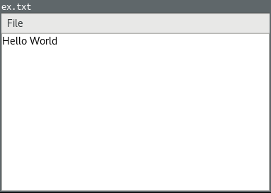
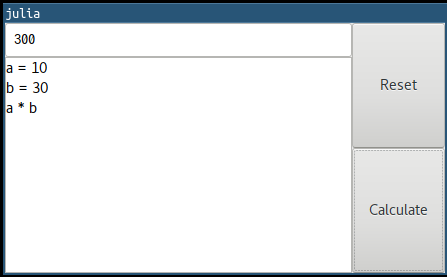
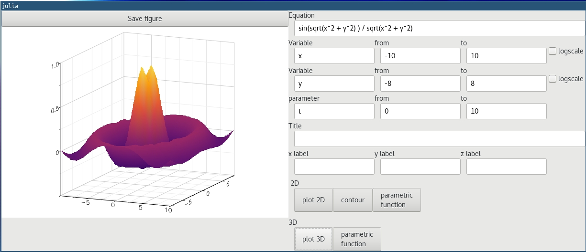

# Julia GUI App Example

These are GUI apps in Julia. They are made of GTK.

## REQUIRE
- Julia 1.4
- [Gtk.jl](https://github.com/JuliaGraphics/Gtk.jl)
- [PackageCompiler.jl](https://github.com/JuliaLang/PackageCompiler.jl) if you build an executable

```julia
using Pkg
Pkg.add("Gtk")
Pkg.add("PackageCompiler")
```

### Docker

e.g.
```
$ docker-compose build
$ docker-compose run juliagtk /bin/bash
$ cd example/CountClick
$ julia --project -e 'using Pkg; Pkg.instantiate()'
$ julia CountClick.jl
```

## Reference
- [Gtk.jl documentation](http://juliagraphics.github.io/Gtk.jl/latest/)
- [GTK+ 3 Reference Manual](https://developer.gnome.org/gtk3/stable/)

## Screenshots
### [Count Click](./example/CountClick)


### [Calculate Area](./example/CalArea)


### [Bingo machine](./example/BingoMachine)


### [Conway's Game of Life](./example/GameOfLife)


### [Conway's Game of Life (interactive)](./example/GameOfLife_Interact)


### [Tic Tac Toe](./example/Tictactoe)


### [Text editor](./example/TextEditor)



### [Calculator](./example/Calculator)


### [Plot function](./example/Plotfunction)


### [Reversi](./example/Reversi)


