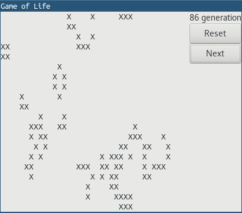

# Julia GUI App Example

These are GUI apps in Julia. They are made of GTK.

## REQUIRE
- [Gtk.jl](https://github.com/JuliaGraphics/Gtk.jl)

```julia
Pkg.add("Gtk")
```

## Reference
[GTK+ 3 Reference Manual](https://developer.gnome.org/gtk3/stable/)

## Screenshots





