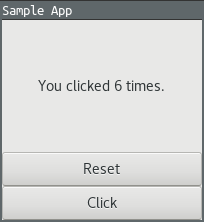

# Environment
- Julia 1.4
- Gtk.jl 1.1.3
- PackageCompiler.jl 1.1.0




```bash
julia --project CountClick.jl

julia --project CountClickandReset.jl
```

# Building an executable
```bash
$ cd Compile
$ julia -q --project -e 'using PackageCompiler; create_app("CountClick", "CountClickCompiled")'
$ CountClickCompiled/bin/CountClick
```
