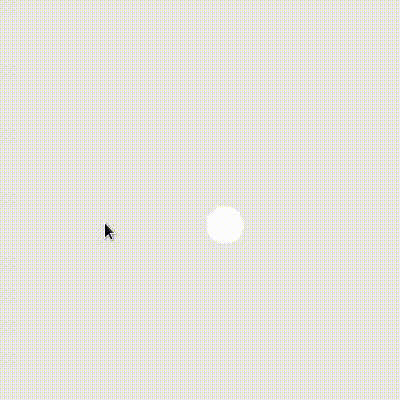

# Environment
- Julia 1.0
- Gtk.jl v0.16.4
- PackageCompiler v0.5.0




# Building an executable

```bash
$ julia -e 'using PackageCompiler; build_executable("reversi.jl", "reversi")'
$ builddir/click
```
